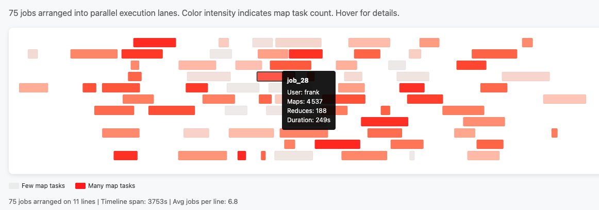

# NAME

Algorithm::TimelinePacking - Arrange time intervals into non-overlapping lines

## Example Output

The module arranges overlapping time intervals into non-overlapping rows,
perfect for Gantt-style visualizations:

*75 Hadoop MapReduce jobs arranged into 11 parallel execution lanes.
See `examples/hadoop-jobs.html` for the full demo.*

# SYNOPSIS

    use Algorithm::TimelinePacking;

    my $packer = Algorithm::TimelinePacking->new(
        space => 5,      # minimum gap between intervals on same line
        width => 1000,   # optional: scale output to fit this width
    );

    # Each slice: [start, end, ...metadata]
    my @slices = (
        [1000, 1200, 'job1', 'alice'],
        [1100, 1300, 'job2', 'bob'],    # overlaps with job1
        [1500, 1600, 'job3', 'carol'],
    );

    my ($lines, $latest) = $packer->arrange_slices(\@slices);

    # $lines is an arrayref of arrayrefs, each containing non-overlapping slices
    # $latest is the normalized end timestamp

# DESCRIPTION

Algorithm::TimelinePacking solves the interval graph coloring problem: given a
set of potentially overlapping time intervals, it assigns them to the minimum
number of "lines" (rows) such that no two intervals on the same line overlap.

Originally developed to visualize Hadoop MapReduce job execution timelines,
the algorithm is completely generic and works for any Gantt-style visualization:
conference schedules, meeting room allocation, project timelines, TV programming,
resource booking systems, or any scenario with overlapping time ranges.

The algorithm uses a greedy first-fit approach, placing each interval on the
first available line where it fits without overlap.

# EXAMPLES

## Conference Schedule

Arrange talks into rooms so no two talks overlap in the same room:

    use Algorithm::TimelinePacking;

    my $packer = Algorithm::TimelinePacking->new(space => 15);  # 15 min between talks

    # Talks: [start_minutes, end_minutes, title, speaker, track]
    my @talks = (
        [540,  600, 'Opening Keynote',       'Margot Tenenbaum', 'keynote'],
        [600,  645, 'GopherScript for Beginners', 'Kevin McCallister', 'beginner'],
        [600,  645, 'Advanced Burrow Patterns',   'Ferris Mueller', 'advanced'],
        [600,  690, 'Workshop: Testing',     'Beatrix Bourbon', 'workshop'],
        [660,  705, 'Database Wrangling',    'Chester Copperpot', 'beginner'],
        [660,  705, 'Unsafe Memory Access',  'Wanda Maximoff', 'advanced'],
        [720,  780, 'Lunch',                 '',        'break'],
        [780,  825, 'Async/Await Deep Dive', 'Inigo Montoya', 'advanced'],
        [780,  870, 'Workshop: Web Apps',    'Rufus Firefly', 'workshop'],
        [840,  900, 'Closing Panel',         'Various', 'keynote'],
    );

    my ($rooms, $end) = $packer->arrange_slices(\@talks);

    for my $i (0 .. $#$rooms) {
        print "Room ", $i + 1, ":\n";
        for my $talk (@{$rooms->[$i]}) {
            printf "  %02d:%02d - %s (%s)\n",
                int($talk->[0] / 60), $talk->[0] % 60,
                $talk->[2], $talk->[3];
        }
    }

    # Output shows minimum rooms needed, with no scheduling conflicts

## Hadoop Job Timeline

The original use case - visualize MapReduce job execution:

    my @jobs = (
        [$start_epoch, $end_epoch, $job_id, $user, $map_tasks, $reduce_tasks],
        ...
    );

    my ($lines, $latest) = $packer->arrange_slices(\@jobs);
    # Feed $lines to D3.js or other visualization library

# ATTRIBUTES

## space

    my $packer = Algorithm::TimelinePacking->new(space => 10);

Minimum space (in the same units as your timestamps) required between
consecutive intervals on the same line. Default: 0.

## width

    my $packer = Algorithm::TimelinePacking->new(width => 800);

If set, all intervals will be scaled to fit within this width. The scaling
preserves relative positions and durations. Default: undef (no scaling).

# METHODS

## arrange\_slices

    my ($lines, $latest) = $packer->arrange_slices(\@slices);

Takes an arrayref of slices and returns:

- `$lines` - arrayref of lines, each containing non-overlapping slices
- `$latest` - the normalized maximum end timestamp

Each input slice must be an arrayref where the first two elements are
start and end timestamps. Additional elements (metadata) are preserved.

    [start, end, ...optional_metadata]

The slices are modified in place (normalized to start at 0, optionally scaled).

# ALGORITHM

The packing uses a greedy first-fit approach:

1. Sort intervals by start time (secondary sort by end time)
2. Normalize all timestamps to start at 0
3. Optionally scale to fit within specified width
4. For each interval, place it on the first line where it fits
5. If no line has room, create a new line
6. Shuffle the final line order for visual balance

Time complexity: O(n² log n) where n is the number of intervals.

# AUTHOR

David Morel <david.morel@amakuru.net>

# LICENSE

This library is free software; you can redistribute it and/or modify
it under the same terms as Perl itself.
