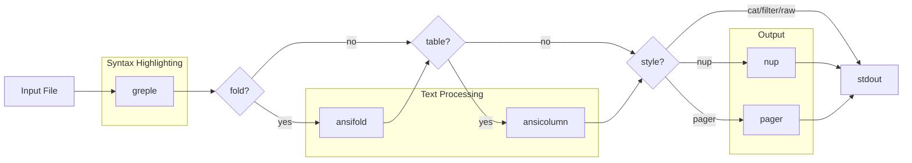

# App-mdee Project Instructions

## Overview

em·dee (mdee: Markdown, Easy on the Eyes) is a Markdown viewer command implemented as a Bash script. It combines greple for syntax highlighting with nup for multi-column paged output.

## Dependencies

| Tool | Package | Role |
|------|---------|------|
| greple | App::Greple | Regex-based syntax highlighting |
| ansifold | App::ansifold | ANSI-aware line folding |
| ansicolumn | App::ansicolumn | Table column alignment |
| nup | App::nup | Multi-column paged output |
| ansiecho | App::ansiecho | Color output utility |
| getoptlong.sh | Getopt::Long::Bash | Bash option parsing |
| termcolor | Getopt::EX::termcolor | Terminal luminance detection |

## Project Structure

- `script/mdee` - Main script (Bash) with POD documentation
- `lib/App/mdee.pm` - Perl module (version info only, generated from script/mdee)
- `t/` - Test files
- `t/test.md` - Color test file

**Important:** Documentation (POD) must be written in `script/mdee`. At release time, `minil release` hooks append the POD from `script/mdee` to `lib/App/mdee.pm` (see `minil.toml`).

## Development

### Testing Colors

```bash
./script/mdee t/test.md              # light mode (nup style)
./script/mdee --mode=dark t/test.md  # dark mode
./script/mdee -p t/test.md           # pager style
./script/mdee -f t/test.md           # filter style (stdout)
./script/mdee --list-themes          # show theme samples
```

### Theme System

Built-in themes are defined as Bash associative arrays:
- `theme_light` - Light mode theme (full definition, includes `[base]`)
- `theme_dark` - Dark mode theme (differences from light, includes `[base]`)

Dark theme inherits undefined keys from light immediately after declaration (before config.sh is sourced). This ensures that both arrays have all keys, so config.sh and theme files can safely use `+=` on any key.

#### Theme as Transformation

Themes are not independent definitions — they are **transformations applied to `theme_light`/`theme_dark`**. Each theme file is a Bash script that modifies these arrays directly:

```bash
# share/theme/warm.sh — change base color
theme_light[base]='<Coral>=y25'
theme_dark[base]='<Coral>=y80'
```

```bash
# share/theme/closing.sh — append closing hashes to h3-h6
for _mode in light dark; do
    declare -n _theme="theme_${_mode}"
    _theme[h3]+=';sub{s/(?<!#)$/ ###/r}'
    _theme[h4]+=';sub{s/(?<!#)$/ ####/r}'
    _theme[h5]+=';sub{s/(?<!#)$/ #####/r}'
    _theme[h6]+=';sub{s/(?<!#)$/ ######/r}'
done
```

#### Chaining Themes

The `--theme` option is an array (`@` type), supporting comma-separated values and repeated options. Themes are applied in order, each modifying `theme_light`/`theme_dark`:

```bash
mdee --theme=warm,closing file.md    # Coral base + closing hashes
mdee --theme=warm --theme=closing    # same effect
```

Processing flow:
1. Each theme file is sourced in order (modifies `theme_light`/`theme_dark`)
2. `load_theme "default" "$mode"` copies the final result to `colors[]`
3. `expand_theme` expands `${base}` references

#### Theme File Locations

Search order for theme files:

1. User theme: `${XDG_CONFIG_HOME:-$HOME/.config}/mdee/theme/NAME.sh`
2. Share theme: `$share_dir/theme/NAME.sh` (installed via distribution or `../share` in development)

The `find_share_dir()` function discovers the installed share directory via `@INC`, with a development fallback to `$0/../share`.

#### User Configuration as Theme

Config.sh can also modify themes directly, using the same mechanism:

```bash
# config.sh example: append to both light and dark
for _array in theme_light theme_dark; do
    declare -n _theme=$_array
    _theme[h3]+=';sub{s/(?<!#)$/ ###/r}'
done
```

#### Theme Listing

- `--list-themes`: Shows preview samples for all available themes. Each theme is previewed by temporarily applying it to a copy of the default, then restoring.
- `--theme=?`: Lists theme names only.

Field names are derived from theme keys (excluding `base`):

```bash
declare -a show_fields=()
for k in "${!theme_light[@]}"; do
    [[ $k != base ]] && show_fields+=("$k")
done
```

Color specifications use [Term::ANSIColor::Concise](https://metacpan.org/pod/Term::ANSIColor::Concise) format:
- `L00` - `L25`: Gray scale (L00=black, L25=white)
- `${base}`: Base color placeholder (expanded after loading)
- `+l10` / `-l10`: Adjust lightness
- `=l50`: Set absolute lightness
- `D`: Bold, `I`: Italic, `U`: Underline, `E`: Erase line
- `FG/BG`: Foreground/Background

### User Configuration

Config file: `${XDG_CONFIG_HOME:-~/.config}/mdee/config.sh`

The config file is sourced at global scope (not inside a function), so `declare -A` creates global variables. This allows custom themes to be defined in config.sh.

The `default` associative array supports:

| Key | Option | Example |
|-----|--------|---------|
| `default[mode]` | `--mode` | `dark` |
| `default[theme]` | `--theme` | `custom` |
| `default[style]` | `--style` | `pager` |
| `default[width]` | `--width` | `100` |
| `default[base_color]` | `--base-color` | `DarkCyan` |

Priority: command-line option > config default > built-in default.

The `--base-color` option default is empty (no override). Base color is determined by:
1. `--base-color` option (highest priority)
2. `default[base_color]` in config.sh
3. Theme's `[base]` key (e.g., `<RoyalBlue>=y25` for light)

## Implementation Notes

### Pipeline Architecture

mdee constructs a pipeline dynamically:



Each stage is controlled by `--style` and individual `--[no-]fold`, `--[no-]table`, `--[no-]rule`, `--[no-]nup` options.

### Style System

The `--style` (`-s`) option controls which pipeline stages are active:

| Style | fold | table | rule | nup | pager | Use case |
|-------|------|-------|------|-----|-------|----------|
| `nup` (default) | on | on | on | on | - | Multi-column paged output |
| `pager` | on | on | on | - | on | Single-column with pager |
| `cat` | on | on | on | - | - | Output to stdout |
| `filter` | - | on | on | - | - | Piping / stdin |
| `raw` | - | - | - | - | - | Highlight only |

Shortcuts: `-f` = `--style=filter`, `-p` = `--style=pager`

```bash
mdee -s pager file.md       # fold + table, output to pager
mdee -f file.md             # table only (filter mode)
mdee -p file.md             # fold + table + pager
mdee -f --fold file.md      # filter + fold override
```

#### Implementation

Style defaults are applied after option parsing using a sentinel value:

```bash
[        style | s  :          # output style      ]=nup
[       filter | f   !         # filter mode       ]=
[        plain | p   !         # plain mode        ]=
[         fold |               # line folding      ]=_
[        table |               # table formatting  ]=_
[          nup |               # use nup           ]=_
[         rule |               # table rule lines  ]=_
```

- `fold`/`table`/`nup`/`rule` default to sentinel `_` (not user-set)
- After getoptlong.sh, style defaults are applied only to sentinel values
- Explicit `--fold`/`--no-fold` sets the value to `1`/empty, overriding style
- `filter()` and `plain()` callbacks set `$style` during option parsing
- The `!` marker triggers the callback when option is parsed

```bash
filter() { style=filter; }
plain()  { [[ $plain ]] && style=pager || style=nup; }

# After getoptlong.sh:
case $style in
    nup)    style_defaults=([fold]=1 [table]=1 [nup]=1 [rule]=1) ;;
    pager)  style_defaults=([fold]=1 [table]=1 [nup]=  [rule]=1) ;;
    ...
esac
[[ $fold  == _ ]] && fold=${style_defaults[fold]}
[[ $table == _ ]] && table=${style_defaults[table]}
[[ $nup   == _ ]] && nup=${style_defaults[nup]}
[[ $rule  == _ ]] && rule=${style_defaults[rule]}
[[ ${rule:-} ]] && rule='│'
```

#### Pager Stage

When `style=pager`, the `run_pager` function is appended to the pipeline:

```bash
run_pager() { invoke ${PAGER:-less}; }

# Set defaults for less environment
export LESS="${LESS:--R}"
export LESSANSIENDCHARS="${LESSANSIENDCHARS:-mK}"

# Added to stages when style=pager:
[[ $style == pager ]] && stages+=(run_pager)
```

- `LESS=-R`: Required for ANSI color sequences (set when `LESS` is not defined)
- `LESSANSIENDCHARS=mK`: Recognize SGR (`m`) and erase line (`K`) sequences (set when not defined)
- These affect both direct pager mode and `nup` (which invokes `less` internally)
- User's existing environment settings are not overridden

#### Command Invocation Wrapper

All `run_XXX` functions use `invoke` to execute commands. When `debug > 1` (`-dd`), it prints the full command with quoted arguments to stderr. In dryrun mode, `invoke` skips execution:

```bash
invoke() {
    (( debug > 1 )) && echo "debug: $(printf '%q ' "$@")" >&2
    [[ ${dryrun:-} ]] && return
    "$@"
}
```

Debug levels:
- `-d` (`debug > 0`): color values, pipeline stage names
- `-dd` (`debug > 1`): above + full command lines for each pipeline stage

Dryrun combinations:
- `-dn`: show pipeline as function names (e.g., `run_greple "$@" | run_fold | ...`)
- `-ddn`: show expanded command lines for each stage without executing

### Greple Options

```bash
greple_opts=(-G --ci=G --all --need=0 --filestyle=once --color=always --prologue "$osc8_prologue")
```

- `-G`: Grep mode (line-based matching)
- `--ci=G`: Capture index mode - each captured group gets separate color
- `--all`: Output all lines (not just matches)
- `--need=0`: Output even if no matches
- `--prologue`: Define functions before processing (used for `osc8` function)

### Color Mapping with --cm

The `--cm` option specifies colors for captured groups, comma-separated:

```bash
--cm 'color1,color2,color3' -E '(group1)(group2)(group3)'
```

### Code Block Color Specification

Format: `opening_fence , language , body , closing_fence`

```bash
[code_block]='L10 , L10 , ${base}/L05;E , L10'
```

- 1st: Opening ``` color
- 2nd: Language specifier (e.g., `bash`, `perl`) color
- 3rd: Code body color (with background)
- 4th: Closing ``` color

Regex pattern ([CommonMark Fenced Code Blocks](https://spec.commonmark.org/0.31.2/#fenced-code-blocks)):
```
^ {0,3}(?<bt>`{3,}+|~{3,}+)(.*)\n((?s:.*?))^ {0,3}(\g{bt})
```

- `^ {0,3}`: 0-3 spaces indentation (CommonMark spec)
- `` `{3,}+|~{3,}+ ``: Backticks or tildes (3+ characters)
- Closing fence must use same character as opening

4 capture groups: opening fence, language, body, closing fence

### Inline Code Color Specification

Format: `before , match , after`

```bash
[inline_code]='/L05,/L05,/L05'
```

Regex pattern ([CommonMark Code Spans](https://spec.commonmark.org/0.31.2/#code-spans)):
```
(?<bt>`++)((?:(?!\g{bt}).)++)(\g{bt})
```

3 capture groups: opening backticks, content, closing backticks

### Header Colors

Light mode uses light background with dark text (h1-h3), base color text (h4-h6):
```bash
[h1]='L25DE/${base}'       # Gray text on base background
[h2]='L25DE/${base}+y20'   # Lighter background
[h3]='L25DN/${base}+y30'   # Normal weight, even lighter
[h4]='${base}UD'           # Base color, underline, bold
[h5]='${base}+y20;U'       # Lighter base, underline
[h6]='${base}+y20'         # Lighter base
```

Dark mode uses dark background with light text (h1-h3), base color text (h4-h6):
```bash
[h1]='L00DE/${base}'       # Black text on base background
[h2]='L00DE/${base}-y15'   # Darker background
[h3]='L00DN/${base}-y25'   # Normal weight, even darker
[h4]='${base}UD'           # Base color, underline, bold
[h5]='${base}-y20;U'       # Darker base, underline
[h6]='${base}-y20'         # Darker base
```

Pattern: light uses `+y` to lighten (reduce emphasis), dark uses `-y` to darken (reduce emphasis).

### Greple::tee Module

The `-Mtee` module allows greple to pipe matched regions through external commands.

#### Text Folding with ansifold

```bash
# Patterns defined in patterns_default array:
#   item_prefix  '^\h*(?:[*-]|(?:\d+|#)[.)])\h+'
#   def_pattern  '(?:\A|\G\n|\n\n).+\n\n?(:\h+.*\n)'
#   autoindent   '^\h*(?:[*-]|(?:\d+|#)[.)]|:)\h+|^\h+'

greple \
    -Mtee "&ansifold" --crmode --autoindent="${pattern[autoindent]}" -sw${width} -- \
    --exclude "${pattern[code_block]}" \
    --exclude "${pattern[comment]}" \
    --exclude "${pattern[table]}" \
    -G -E "${pattern[item_prefix]}.*\\n" -E "${pattern[def_pattern]}" \
    --crmode --all --need=0 --no-color
```

- `--exclude`: Exclude code blocks, comments, and tables from fold processing
- `pattern` associative array: Built from `patterns_default`, joins multiple patterns with same name using `|`

- `-Mtee`: Load tee module
- `"&ansifold"`: Call ansifold as function (not subprocess)
- `--crmode`: Handle carriage returns
- `--autoindent="..."`: Auto-indent pattern for list items and definitions
- `-sw${width}`: Silent mode with width
- `--`: Separator between tee args and greple args
- `-GE "..."`: Pattern to match list items
- `-E "..."`: Pattern to match definition lists

##### Definition List Pattern

`def_pattern: '(?:\A|\G\n|\n\n).+\n\n?(:\h+.*\n)'`

- `(?:\A|\G\n|\n\n)`: Start of file, or after previous match, or after blank line
- `.+\n`: Term line
- `\n?`: Optional blank line between term and definition
- `(:\h+.*\n)`: Capture group for definition line (only this part is processed)

#### Table Formatting with ansicolumn

```bash
run_table() {
    invoke greple \
        -Mtee::config=discrete,bulkmode "&ansicolumn" -s '|' -o "${rule:-|}" -t --cu=1 -- \
        -E "${pattern[table]}" --all --need=0 --no-color
}
```

- `-Mtee::config=discrete,bulkmode`: Process each match separately, in bulk mode
- `"&ansicolumn"`: Call ansicolumn as function
- `-s '|'`: Input separator
- `-o "${rule:-|}"`: Output separator (`│` when rule is enabled, `|` otherwise)
- `-t`: Table mode (auto-determine column widths)
- `--cu=1`: Column unit (minimum column width)
- `-E "${pattern[table]}"`: Match 3+ consecutive table rows (0-3 spaces indent allowed)

#### Table Separator Fix

After ansicolumn, a perl script fixes the separator lines within table blocks:

```bash
define fix_table_script <<'EOS'
    use utf8;
    my $rule = shift @ARGV;
    my $sep = $rule || '\|';
    local $_ = do { local $/; <> };
    s{ ^ ($sep ( ( (?:(?!$sep).)*  $sep )+ \n){3,} ) }{
        $1 =~ s{^$sep((?:\h* -+ \h* $sep)*\h* -+ \h*)$sep$}{
            $rule
            ? "├" . ($1 =~ tr[│ -][┼──]r) . "┤"
            : "|" . ($1 =~ tr[ ][-]r) . "|"
        }xmegr;
    }xmepg;
    print;
EOS

run_table_fix() { invoke perl -CSA -E "$fix_table_script" "${rule:-}"; }
```

- `$rule`: Receives `│` (rule enabled) or empty (disabled) from bash `${rule:-}`
- `$sep`: `│` or `\|` (regex pattern for separator matching)
- Outer `s///`: Identifies table blocks (3+ consecutive separator-delimited rows)
- Inner `s///`: Fixes separator lines within each table block
- Rule mode: `tr[│ -][┼──]` converts middle part, wrapped with `├`/`┤`
- Non-rule mode: `tr[ ][-]` replaces spaces with dashes, wrapped with `|`
- `perl -CSA`: UTF-8 handling for STDIN/STDOUT/STDERR and @ARGV

### Field Visibility with --show Option

The `--show` option controls field visibility using a hash type with callback:

```bash
declare -A show=()

declare -A OPTS=(
    [         show |   %!          # field visibility   ]=
)

show() {
    local arg=$2 key val
    if [[ $arg == *=* ]]; then
        key=${arg%%=*} val=${arg#*=}
    else
        key=$arg val=1
    fi
    if [[ $key == all ]]; then
        for k in "${show_fields[@]}"; do
            show[$k]=$val
        done
    fi
}
```

- `%!`: Hash type with callback
- Callback receives `($optname, $arg)` - parse key=value from `$arg`
- `all` is special: sets all fields to the given value
- Order matters: `--show all= --show bold` disables all, then enables bold
- Individual key=value is automatically handled by getoptlong.sh

In `add_pattern`:

```bash
add_pattern() {
    local name=$1 pattern=$2
    local val=${show[$name]-1}  # unset defaults to 1 (enabled)
    [[ $val && $val != 0 ]] && greple_opts+=(--cm "${colors[$name]}" -E "$pattern") || :
}
```

### Emphasis Patterns (CommonMark)

Bold and italic patterns follow [CommonMark emphasis rules](https://spec.commonmark.org/0.31.2/#emphasis-and-strong-emphasis):

```bash
# Bold: ** and __
add_pattern bold '(?<![\\`])\*\*.*?(?<!\\)\*\*'
add_pattern bold '(?<![\\`\w])__.*?(?<!\\)__(?!\w)'

# Italic: * and _
add_pattern italic '(?<![\\`\w])_(?:(?!_).)+(?<!\\)_(?!\w)'
add_pattern italic '(?<![\\`\*])\*(?:(?!\*).)+(?<!\\)\*(?!\*)'

# Strikethrough
add_pattern strike '(?<![\\`])~~.+?(?<!\\)~~'
```

Key rules:
- `(?<!\\)` / `` (?<![\\`]) ``: Not preceded by backslash or backtick (escape handling and inline code protection)
- `` (?<![\\`\w]) `` / `(?!\w)`: Word boundaries for `_`/`__` (prevents `foo_bar_baz` matching and avoids matching inside inline code)
- `(?<!\*)` / `(?!\*)`: Not adjacent to `*` (distinguishes `*italic*` from `**bold**`)
- `(?:(?!\*).)+`: Match any character except `*`, and `.` excludes newlines (single-line only)
- `__` requires word boundaries (same as `_`)
- `**` doesn't require word boundaries (can be used mid-word)

### OSC 8 Hyperlinks

Links are converted to [OSC 8 terminal hyperlinks](https://gist.github.com/egmontkob/eb114294efbcd5adb1944c9f3cb5feda) for clickable URLs:

```bash
# Define osc8 function via --prologue (uses URI::Escape for spec compliance)
osc8_prologue='sub{ use URI::Escape; sub osc8 { sprintf "\e]8;;%s\e\\%s\e]8;;\e\\", uri_escape_utf8($_[0]), $_[1] } }'

# Color functions using named captures
    link_func='sub{ s/   \[(?<txt>.+?)\]\((?<url>.+?)\)/osc8($+{url},  "[$+{txt}]")/xer }'
   image_func='sub{ s/  !\[(?<alt>.+?)\]\((?<url>.+?)\)/osc8($+{url}, "![$+{alt}]")/xer }'
image_link_func='sub{ s/\[!\[(?<alt>.+?)\]\((?.+?)\)\]\((?<url>.+?)\)/osc8($+{img}, "!") . osc8($+{url}, "[$+{alt}]")/xer }'
```

**URL Encoding**: OSC 8 specification requires URLs to contain only bytes in the 32-126 range. From the [spec](https://gist.github.com/egmontkob/eb114294efbcd5adb1944c9f3cb5feda) (Encodings section):

> For portability, the parameters and the URI must not contain any bytes outside of the 32–126 range. If they do, the behavior is undefined. Bytes outside of this range in the URI must be URI-encoded.

Non-ASCII characters (e.g., Japanese filenames) are handled by `uri_escape_utf8`.

Three link patterns:

| Pattern | Input | Output | Link Target |
|---------|-------|--------|-------------|
| link | `[text](url)` | `[text]` | url |
| image | `` | `![alt]` | img |
| image_link | `[](url)` | `![alt]` | img (for `!`) + url (for `[alt]`) |

OSC 8 format: `\e]8;;URL\e\TEXT\e]8;;\e\`
- `\e]8;;URL\e\` - Start hyperlink with URL
- `TEXT` - Displayed text
- `\e]8;;\e\` - End hyperlink

The `osc8` function takes `(URL, TEXT)` order. The `image_link_func` produces two separate OSC 8 links: `!` linked to the image URL and `[alt]` linked to the outer URL.

### Mode Detection with [Getopt::EX::termcolor](https://metacpan.org/pod/Getopt::EX::termcolor)

Terminal background luminance is detected via Getopt::EX::termcolor module.

```bash
detect_terminal_mode() {
    local lum
    lum=$(perl -MGetopt::EX::termcolor=luminance -e luminance 2>/dev/null) || return
    [[ $lum ]] || return
    (( lum < 50 )) && echo dark || echo light
}
```

- `perl -MGetopt::EX::termcolor=luminance`: Import `luminance` function
- `-e luminance`: Execute the function (prints 0-100)
- Returns empty if terminal doesn't support background query
- Luminance < 50: dark mode
- Luminance >= 50: light mode

The module sends OSC 11 query to terminal and parses the response to calculate luminance from RGB values.

### [Getopt::Long::Bash](https://metacpan.org/pod/Getopt::Long::Bash) (getoptlong.sh)

Option parsing uses getoptlong.sh from Getopt::Long::Bash module.

#### OPTS Array Format

```bash
declare -A OPTS=(
    [&REQUIRE]=0.7.1 [&USAGE]="$USAGE"
    [  option | o  :  # comment  ]=default
)
```

Key format: `option_name | short_opt  spec  # comment`

- `option_name`: Long option name (becomes variable `$option_name`)
- `short_opt`: Single character short option
- `spec`: Option specification
- `# comment`: Description for help

#### Option Specifications

|Spec|Type|Description|
|-|-|-|
|(empty)|Boolean|Flag, sets variable to 1|
|`!`|Negatable|Supports `--no-option`|
|`+`|Incremental|Counter, increases with each use|
|`:`|Required arg|Requires argument value|
|`:=i`|Integer|Requires integer argument|
|`?!`|Optional+Negatable|Optional argument, negatable|
|`:>array`|Array append|Appends `--option=value` to array|
|`@`|Array|Array variable, supports comma-separated values|

#### Special Keys

- `[&REQUIRE]=version`: Minimum getoptlong.sh version
- `[&USAGE]="..."`: Usage message for --help

#### Callback Functions

If a function with the same name as an option exists, it's called after parsing:

```bash
pager() {
    [[ $pager ]] && nup_opts+=("--pager=$pager") || nup_opts+=("--no-pager")
}
```

#### Invocation

```bash
. getoptlong.sh OPTS "$@"
```

Sources the library with OPTS array name and arguments.

### Dependencies

- App::Greple - Pattern matching and highlighting tool with extensive regex support, used for syntax highlighting of Markdown elements including headers, bold text, inline code, and fenced code blocks
- App::ansifold - ANSI-aware text folding utility that wraps long lines while preserving escape sequences and maintaining proper indentation for nested list items
- App::ansicolumn - Column formatting tool with ANSI support that aligns table columns while preserving color codes
- App::nup - Paged output
- App::ansiecho - Color output
- Getopt::Long::Bash - Option parsing
- Getopt::EX::termcolor - Terminal detection

## Limitations

### HTML Comments

Only HTML comments starting at the beginning of a line are highlighted. Inline comments are not matched to avoid conflicts with inline code containing comment-like text (e.g., `` `<!-->` ``).

### Emphasis (Bold/Italic)

Emphasis patterns do not span multiple lines. Multi-line bold or italic text is not supported.

### Links

Link patterns do not span multiple lines. The link text and URL must be on the same line.

Reference-style links (`[text][ref]` with `[ref]: url` elsewhere) are not supported.

### Indented Line Folding (TODO)

Lines starting with whitespace are not currently folded. Adding `^\h+.*\n` to the fold target would enable autoindent-aware wrapping, but the following issues must be resolved first:

1. **Pandoc non-pipe tables**: Simple tables, grid tables, and multiline tables use lines starting with spaces/dashes. These would be incorrectly folded. Pandoc table detection and exclusion is needed before enabling indented line folding.

2. **List continuation lines**: Indented continuation lines (without list markers) may be intentionally formatted across multiple lines. Folding them would merge separate items.

The `autoindent` pattern in `patterns_default` already includes `|^\h+` in preparation. The `--exclude` mechanism (using `pattern` associative array) is in place for code blocks, comments, and tables.

### OSC 8 Hyperlinks

OSC 8 hyperlinks require terminal support. Compatible terminals include iTerm2, Kitty, WezTerm, Ghostty, and recent versions of GNOME Terminal. Apple's default Terminal.app does not support OSC 8.

When using `less` as pager, version 566 or later is required with `-R` option.

## Build & Release

This project uses Minilla. See global CLAUDE.md for release instructions.

```bash
minil build    # Build and update generated files
minil test     # Run tests
minil release  # Release (interactive)
```

## Markdown Syntax Reference

This section demonstrates various Markdown syntax for testing mdee rendering.

### Blockquotes

> This is a blockquote.
> It can span multiple lines.

> Nested blockquote:
> > Inner quote with **bold** and `code`.

### Numbered Lists

1. First item
2. Second item with `inline code`
3. Third item with **bold text**

### Nested Lists

- Top level item
  - Second level with a longer description that should wrap when displayed in narrow width
    - Third level item
  - Another second level
- Back to top level

1. Numbered top level
   1. Nested numbered
   2. Another nested
2. Back to top

### Task Lists

- [x] Completed task
- [ ] Incomplete task with `code`
- [ ] Another todo item

### Horizontal Rules

Above the line.

---

Below the line.

### Links

- Inline link: [Greple documentation](https://metacpan.org/pod/App::Greple)
- Reference link: [Term::ANSIColor::Concise][tac]

[tac]: https://metacpan.org/pod/Term::ANSIColor::Concise

### Strikethrough

This is ~~deleted text~~ with strikethrough.

### Italic Text

Both syntaxes are supported:
- *Single asterisks* for italic
- _Single underscores_ for italic

Underscores require word boundaries: `foo_bar_baz` is not italic.

### Mixed Formatting

> **Important:** Use `--mode=dark` for dark terminals.
>
> ~~Old syntax~~ is deprecated. Use the new **`--theme`** option instead.
> Also supports *italic* and _emphasis_.

### Definition-style Content

**Term 1**
: Definition of the first term with `code` example.

**Term 2**
: Definition of the second term spanning a longer line that might need to be wrapped when displayed.
