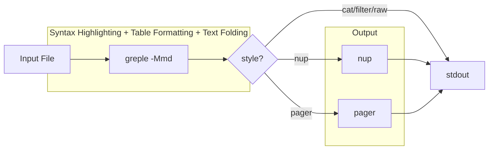

# App-mdee Project Instructions

## Overview

em·dee (mdee: Markdown, Easy on the Eyes) is a Markdown viewer command implemented as a Bash script. It combines greple for syntax highlighting with nup for multi-column paged output.

## Dependencies

| Tool | Package | Role |
|------|---------|------|
| greple | App::Greple | Regex-based syntax highlighting |
| ansifold | App::ansifold | ANSI-aware line folding (via md module) |
| ansicolumn | App::ansicolumn | Table column alignment (via md module) |
| nup | App::nup | Multi-column paged output |
| ansiecho | App::ansiecho | Color output utility |
| getoptlong.sh | Getopt::Long::Bash | Bash option parsing |
| termcolor | Getopt::EX::termcolor | Terminal luminance detection |
| - | Getopt::EX::Config | Module option handling |
| - | Command::Run | Function call wrapper for ansicolumn |

## Project Structure

- `script/mdee` - Main script (Bash) with POD documentation
- `lib/App/mdee.pm` - Perl module (version info only, generated from script/mdee)
- `lib/App/Greple/md.pm` - Greple module for Markdown syntax highlighting (bundled)
- `t/00_compile.t` - Compile tests for both App::mdee and App::Greple::md
- `t/01_mdee.t` - mdee command integration tests
- `t/02_colorize.t` - md module colorize tests (uses t/runner)
- `t/03_nofork.t` - nofork vs fork table formatting tests
- `t/04_table_align.t` - Table alignment tests (parse_separator unit + integration)
- `t/Util.pm` - Test helper for greple-based tests
- `t/runner/` - Submodule (p5-script-runner) for finding greple path
- `t/test.md` - Test Markdown file

**Important:** Documentation (POD) must be written in `script/mdee`. At release time, `minil release` hooks append the POD from `script/mdee` to `lib/App/mdee.pm` (see `minil.toml`).

## Development

### Testing Colors

```bash
./script/mdee t/test.md              # light mode (nup style)
./script/mdee --mode=dark t/test.md  # dark mode
./script/mdee -p t/test.md           # pager style
./script/mdee -f t/test.md           # filter style (stdout)
./script/mdee --list-themes          # show theme samples
```

### Theme System

Built-in themes are defined as Bash associative arrays:
- `theme_light` - Light mode theme (full definition, includes `[base]`)
- `theme_dark` - Dark mode theme (differences from light, includes `[base]`)

Dark theme inherits undefined keys from light immediately after declaration (before config.sh is sourced). This ensures that both arrays have all keys, so config.sh and theme files can safely use `+=` on any key.

#### Theme as Transformation

Themes are not independent definitions — they are **transformations applied to `theme_light`/`theme_dark` and optionally `md_config[]`**. Each theme file is a Bash script that modifies these arrays directly:

```bash
# share/theme/warm.sh — change base color
theme_light[base]='<Coral>=y25'
theme_dark[base]='<Coral>=y80'
```

```bash
# share/theme/hashed.sh — enable closing hashes on h3-h6 via md module config
md_config+=(hashed.h3=1 hashed.h4=1 hashed.h5=1 hashed.h6=1)
```

#### Chaining Themes

The `--theme` option is an array (`@` type) with default value `hashed`, supporting comma-separated values and repeated options. Themes accumulate (added to the default); use `--no-theme` to clear. Duplicate themes are removed by `uniq_array`. Themes are applied in order, each modifying `theme_light`/`theme_dark`:

```bash
mdee file.md                        # default: hashed theme applied
mdee --theme=warm file.md           # hashed (default) + warm
mdee --no-theme file.md             # no theme
mdee --no-theme --theme=warm        # warm only (clear default first)
```

Processing flow:
1. Each theme file is sourced in order (modifies `theme_light`/`theme_dark` and/or `md_config[]`)
2. `load_theme "$mode"` copies the final result to `colors[]`
3. `expand_theme` expands `${base}` references

#### Theme File Locations

Search order for theme files:

1. User theme: `${XDG_CONFIG_HOME:-$HOME/.config}/mdee/theme/NAME.sh`
2. Share theme: `$share_dir/theme/NAME.sh` (installed via distribution or `../share` in development)

The `find_share_dir()` function discovers the installed share directory via `@INC`, with a development fallback to `$0/../share`.

#### User Configuration as Theme

Config.sh and theme files can also modify colors and md module config:

```bash
# config.sh or theme file: change base color
theme_light[base]='<DarkCyan>=y25'
theme_dark[base]='<DarkCyan>=y80'

# config.sh or theme file: enable hashed headings via md module config
md_config+=(hashed.h3=1 hashed.h4=1 hashed.h5=1 hashed.h6=1)
```

#### Theme Listing

- `--list-themes`: Shows preview samples for all available themes. Each theme is previewed by temporarily applying it to a copy of the default, then restoring.

Field names are derived from theme keys (excluding `base`):

```bash
declare -a show_fields=()
for k in "${!theme_light[@]}"; do
    [[ $k != base ]] && show_fields+=("$k")
done
```

Color specifications use [Term::ANSIColor::Concise](https://metacpan.org/pod/Term::ANSIColor::Concise) format:
- `L00` - `L25`: Gray scale (L00=black, L25=white)
- `${base}`: Base color placeholder (expanded after loading)
- `+l10` / `-l10`: Adjust lightness
- `=l50`: Set absolute lightness
- `D`: Bold, `I`: Italic, `U`: Underline, `E`: Erase line
- `FG/BG`: Foreground/Background

### User Configuration

Config file: `${XDG_CONFIG_HOME:-~/.config}/mdee/config.sh`

The config file is sourced at global scope (not inside a function), so `declare -A` creates global variables. This allows custom themes to be defined in config.sh.

The `default` associative array supports:

| Key | Option | Example |
|-----|--------|---------|
| `default[mode]` | `--mode` | `dark` |
| `default[theme]` | `--theme` | `custom` |
| `default[style]` | `--style` | `pager` |
| `default[width]` | `--width` | `100` |
| `default[base_color]` | `--base-color` | `DarkCyan` |

Priority: command-line option > config default > built-in default.

Config defaults for `default[theme]` are applied only when `--theme`/`--no-theme` is not specified on the command line. A `theme()` callback sets `_theme_specified` flag to track this.

The `--base-color` option default is empty (no override). Base color is determined by:
1. `--base-color` option (highest priority)
2. `default[base_color]` in config.sh
3. Theme's `[base]` key (e.g., `<RoyalBlue>=y25` for light)

## Implementation Notes

### Pipeline Architecture

mdee constructs a pipeline dynamically:



Each stage is controlled by `--style` and individual `--[no-]fold`, `--[no-]table`, `--[no-]rule`, `--[no-]nup` options. Fold and table processing are handled within the greple `-Mmd` module (not as separate pipeline stages).

### Style System

The `--style` (`-s`) option controls which pipeline stages are active:

| Style | fold | table | rule | nup | pager | Use case |
|-------|------|-------|------|-----|-------|----------|
| `nup` (default) | on | on | on | on | - | Multi-column paged output |
| `pager` | on | on | on | - | on | Single-column with pager |
| `cat` | on | on | on | - | - | Output to stdout |
| `filter` | - | on | on | - | - | Piping / stdin |
| `raw` | - | - | - | - | - | Highlight only |

Shortcuts: `-f` = `--style=filter`, `-p` = `--style=pager`

```bash
mdee -s pager file.md       # fold + table, output to pager
mdee -f file.md             # table only (filter mode)
mdee -p file.md             # fold + table + pager
mdee -f --fold file.md      # filter + fold override
```

#### Implementation

Style defaults are applied after option parsing using a sentinel value:

```bash
[        style | s  :          # output style      ]=nup
[       filter | f   !         # filter mode       ]=
[        plain | p   !         # plain mode        ]=
[         fold |               # line folding      ]=_
[        table |               # table formatting  ]=_
[          nup |               # use nup           ]=_
[         rule |               # table rule lines  ]=_
```

- `fold`/`table`/`nup`/`rule` default to sentinel `_` (not user-set)
- After getoptlong.sh, style defaults are applied only to sentinel values
- Explicit `--fold`/`--no-fold` sets the value to `1`/empty, overriding style
- `filter()` and `plain()` callbacks set `$style` during option parsing
- The `!` marker triggers the callback when option is parsed

```bash
filter() { style=filter; }
plain()  { [[ $plain ]] && style=pager || style=nup; }

# After getoptlong.sh:
case $style in
    nup)    style_defaults=([fold]=1 [table]=1 [nup]=1 [rule]=1) ;;
    pager)  style_defaults=([fold]=1 [table]=1 [nup]=  [rule]=1) ;;
    ...
esac
[[ $fold  == _ ]] && fold=${style_defaults[fold]}
[[ $table == _ ]] && table=${style_defaults[table]}
[[ $nup   == _ ]] && nup=${style_defaults[nup]}
[[ $rule  == _ ]] && rule=${style_defaults[rule]}
[[ ${rule:-} ]] && rule='│'
```

#### Pager Stage

When `style=pager`, the `run_pager` function is appended to the pipeline:

```bash
run_pager() { invoke ${PAGER:-less}; }

# Set defaults for less environment
export LESS="${LESS:--R}"
export LESSANSIENDCHARS="${LESSANSIENDCHARS:-mK}"

# Added to stages when style=pager:
[[ $style == pager ]] && stages+=(run_pager)
```

- `LESS=-R`: Required for ANSI color sequences (set when `LESS` is not defined)
- `LESSANSIENDCHARS=mK`: Recognize SGR (`m`) and erase line (`K`) sequences (set when not defined)
- These affect both direct pager mode and `nup` (which invokes `less` internally)
- User's existing environment settings are not overridden

#### Command Invocation Wrapper

All `run_XXX` functions use `invoke` to execute commands. When `debug > 1` (`-dd`), it prints the full command with quoted arguments to stderr. In dryrun mode, `invoke` skips execution:

```bash
invoke() {
    (( debug > 1 )) && echo "debug: $(printf '%q ' "$@")" >&2
    [[ ${dryrun:-} ]] && return
    "$@"
}
```

Debug levels:
- `-d` (`debug > 0`): `theme_light[]`/`theme_dark[]` values (sourceable format), pipeline stage names
- `-dd` (`debug > 1`): above + full command lines for each pipeline stage

Dryrun combinations:
- `-dn`: show pipeline as function names (e.g., `run_greple "$@" | run_nup`)
- `-ddn`: show expanded command lines for each stage without executing

### App::Greple::md Module

Syntax highlighting, table formatting, and text folding are handled by the `App::Greple::md` Perl module. mdee invokes greple with the module and passes config/visibility options as module options (before `--`):

```bash
run_greple() {
    local -a md_opts=()
    local -a config_params=("mode=${mode}")

    # fold/table/rule/heading_markup params
    [[ $fold  ]] && config_params+=("foldlist=1,foldwidth=$width")
    [[ $table ]] && config_params+=("table=1") || config_params+=("table=0")
    [[ $rule  ]] && config_params+=("rule=1")  || config_params+=("rule=0")
    [[ $heading_markup ]] && config_params+=("heading_markup=$heading_markup")
    config_params+=("${md_config[@]}")

    local IFS=','
    md_opts+=("-Mmd::config(${config_params[*]})")
    unset IFS

    for name in "${!show[@]}"; do
        [[ $name == all ]] && continue
        md_opts+=(--show "${name}=${show[$name]}")
    done

    invoke greple "${md_opts[@]}" "${pass_md[@]}" -- \
        --filter --filestyle=once --color=always \
        "$@"
}
```

- `-Mmd::config(...)`: Module config parameters (mode, base_color, foldlist, foldwidth, table, rule, heading_markup, hashed.*)
- `--show LABEL=VALUE`: Field visibility control
- `pass_md[]`: Passthrough options for md module (e.g., `--colormap` via `:>pass_md`)
- Options before `--` are module-specific; after `--` are greple options
- Fold is controlled via `foldlist=1` in config; the md module adds `--fold-by $foldwidth` to its default option

### Protection Mechanism (protect/restore)

The `colorize()` function processes patterns in priority order. Early-processed
regions (code blocks, inline code, comments, links) must be protected from
later patterns (headings, emphasis, strikethrough). The protect/restore
mechanism replaces processed text with ANSI-based placeholders:

```perl
my($PS, $PE) = ("\e[256m", "\e[m");     # protect start/end markers
my $PR = qr/\e\[256m(\d+)\e\[m/;       # protect restore pattern
my($OS, $OE) = ("\e]8;;", "\e\\");      # OSC 8 start/end markers

sub protect {
    my $text = shift;
    push @protected, $text;
    $PS . $#protected . $PE;
}

sub restore {
    my $s = shift;
    1 while $s =~ s{$PR}{$protected[$1] // die "restore failed: index $1"}ge;
    $s;
}
```

Placeholder format: `\e[256mN\e[m]` where:
- `\e[256m` — SGR parameter 256 ("color not found": the 256-color palette
  uses indices 0-255, so 256 is an impossible color that terminals ignore)
- `N` — index into `@protected` array
- `\e[m` — standard SGR reset

The `\e[m` end marker is key: when `apply_color` (from `Term::ANSIColor::Concise`)
wraps the placeholder with an outer color (e.g., heading), it detects the `\e[m`
reset and re-inserts the outer color after it. This enables **cumulative coloring**
— for example, a link inside a heading:

1. Link is colored and protected: `[text](url)` → `\e[256m0\e[m`
2. Heading wraps the line: `\e[h2]## Title \e[256m0\e[m\e[h2] after\e[m`
3. Restore replaces placeholder: `\e[h2]## Title \e[link][text]\e[m\e[h2] after\e[m`

The heading color resumes after the link, including background color for
text that follows the link on the same heading line.

Each processing step is a `Step` object in the `%colorize` hash, created
by `Step(sub{})` (always active) or `Step(label => sub{})` (controllable
via `--show`). The pipeline order is determined by `build_pipeline()`
based on `heading_markup`.

```perl
package App::Greple::md::Step {
    sub new    { my($class, %args) = @_; bless \%args, $class }
    sub label  { $_[0]->{label} }
    sub active { !$_[0]->{label} || App::Greple::md::active($_[0]->{label}) }
    sub run    { $_[0]->{code}->() }
}

sub Step {
    my $code = pop;
    my $label = shift;
    App::Greple::md::Step->new(label => $label, code => $code);
}

# Always active (no label):
code_blocks => Step(sub { ... }),

# Controllable via --show (with label):
bold => Step(bold => sub { ... }),
headings => Step(header => sub { ... }),
```

#### Pipeline Architecture

Steps are organized into three groups:

```perl
my @protect_steps = qw(code_blocks comments image_links images links);
my @inline_steps  = qw(inline_code horizontal_rules bold_italic bold italic strike);
my @final_steps   = qw(blockquotes);
```

The `headings` step always calls `restore()` → color → `protect()`,
enabling cumulative coloring regardless of position. Its position
in the pipeline is controlled by `heading_markup`:

**`build_pipeline()` logic:**
- `heading_markup=0` (default): `@protect_steps`, **headings**, `@inline_steps`, `@final_steps`
- `heading_markup=1` or `all`: `@protect_steps`, `@inline_steps`, **headings**, `@final_steps`
- `heading_markup=bold:italic`: `@protect_steps`, bold, italic, **headings**, inline_code, horizontal_rules, strike, `@final_steps`

When `heading_markup` is a colon-separated step list, specified steps
are moved before headings while remaining inline steps stay after.
This allows selective markup inside headings (e.g., bold but not code).

Links are always processed before headings (in `@protect_steps`), so
OSC 8 hyperlinks in headings remain clickable regardless of
`heading_markup`.

The `colorize()` loop calls `$step->active` and `$step->run`:

```perl
for my $name (build_pipeline()) {
    my $step = $colorize{$name};
    $step->run if $step->active;
}
```

### Code & Emphasis Color Labels

Code-related and emphasis-related theme keys map directly to module labels:

| Theme Key | Module Label | Description |
|-----------|-------------|-------------|
| `code_mark` | `code_mark` | Fenced code block delimiters (```` ``` ````, `~~~`) |
| `code_tick` | `code_tick` | Inline code backticks (`` ` ``) |
| `code_info` | `code_info` | Fenced code block info string |
| `code_block` | `code_block` | Fenced code block body (with `;E`) |
| `code_inline` | `code_inline` | Inline code body (without `;E`) |
| `emphasis_mark` | `emphasis_mark` | Emphasis markers (`**`, `*`, `__`, `_`, `~~`) |

`emphasis_mark` is the default color for all emphasis markers. Per-type overrides
(`bold_mark`, `italic_mark`, `strike_mark`) can be defined via `--cm` and take
priority when present. This follows the same pattern as `code_tick` / `code_inline`.

```bash
# Light mode
[code_mark]='L20'
[code_tick]='L15/L23'
[code_info]='${base_name}=y70'
[code_block]='/L23;E'
[code_inline]='L00/L23'
[emphasis_mark]='L18'

# Dark mode
[code_mark]='L10'
[code_tick]='L15/L05'
[code_info]='L10'
[code_block]='/L05;E'
[code_inline]='L25/L05'
[emphasis_mark]='L10'
```

The `code_block` label includes `;E` (erase line) for full-width background on fenced code blocks. `code_tick` has background color matching `code_inline` for visual continuity, with dimmer foreground. `code_inline` has explicit foreground (`L00`/`L25`) to prevent heading foreground from bleeding through in cumulative coloring.

Inline code backticks are displayed as `` `content´ `` using `code_tick` color for the markers. Multi-backtick delimiters (``` `` ```, ```` ``` ````, etc.) are collapsed to a single pair, with optional surrounding spaces stripped per CommonMark. The open/close markers are configurable via `tick_open`/`tick_close` config parameters (default: `` ` `` / `´`).

Regex patterns used by the md module:

Fenced code blocks ([CommonMark](https://spec.commonmark.org/0.31.2/#fenced-code-blocks)):
```
^ {0,3}(?<bt>`{3,}+|~{3,}+)(.*)\n((?s:.*?))^ {0,3}(\g{bt})
```

Inline code ([CommonMark Code Spans](https://spec.commonmark.org/0.31.2/#code-spans)) uses the `$CODE` pattern, which matches both single and multi-backtick spans. For multi-backtick (2+), optional leading/trailing spaces are stripped per CommonMark spec.

### Header Colors

Light mode uses light background with dark text (h1-h3), base color text (h4-h6):
```bash
[h1]='L25D/${base};E'      # Gray text on base background
[h2]='L25D/${base}+y20;E'  # Lighter background
[h3]='L25DN/${base}+y30'   # Normal weight, even lighter
[h4]='${base}UD'           # Base color, underline, bold
[h5]='${base}U'            # Base color, underline
[h6]='${base}'             # Base color
```

Dark mode uses dark background with light text (h1-h3), base color text (h4-h6):
```bash
[h1]='L00D/${base};E'      # Black text on base background
[h2]='L00D/${base}-y15;E'  # Darker background
[h3]='L00DN/${base}-y25'   # Normal weight, even darker
[h4]='${base}UD'           # Base color, underline, bold
[h5]='${base}U'            # Base color, underline
[h6]='${base}'             # Base color
```

Pattern: light uses `+y` to lighten (reduce emphasis), dark uses `-y` to darken (reduce emphasis).

### Text Folding (md module)

Text folding is handled within the `App::Greple::md` module using `-Mtee` to pipe matched regions through `ansifold`. The md module defines `--fold-by` as a greple option in its `__DATA__` section, and `--fold` is dynamically defined in `finalize()` via `$mod->setopt()` as a command option alias. The module option `--foldlist` enables folding via config.

#### Fold Architecture

- `foldlist` config parameter (default: 0) enables/disables folding
- `foldwidth` config parameter (default: 80) controls the fold width
- `finalize()` defines `--fold` as `--fold-by $foldwidth` via `$mod->setopt()` (for direct command-line use)
- When `foldlist=1` in config, `finalize()` adds `--fold-by $foldwidth` to the module's default option
- mdee passes `foldlist=1,foldwidth=$width` in config when fold is enabled
- The `--fold-by` option in `__DATA__` uses `-Mtee "&ansifold"` with `--exclude` patterns for code blocks, HTML comments, and tables

#### Definition List Pattern

`(?:\A|\G\n|\n\n).+\n\n?(:\h+.*\n)`

- `(?:\A|\G\n|\n\n)`: Start of file, or after previous match, or after blank line
- `.+\n`: Term line
- `\n?`: Optional blank line between term and definition
- `(:\h+.*\n)`: Capture group for definition line (only this part is processed)

#### Table Formatting in md Module

Table formatting is handled within the `App::Greple::md` module's `begin()` function, which orchestrates `colorize()` (syntax highlighting) followed by `format_table()`:

```perl
sub begin {
    colorize()    if $config->{colorize};
    format_table() if $config->{table};
}
```

Stage execution is controlled by config flags: `colorize` (default: 1), `table` (default: 1). Fold is not controlled in `begin()` because it operates via greple's pattern matching pipeline (`-Mtee`), not text transformation in the `begin` hook.

`format_table()` detects table blocks via `^ {0,3}\|.+\|\n){3,}` and processes each block:

1. **Alignment parsing** — `parse_separator()` analyzes the separator line (e.g., `|:---|:---:|---:|---|`):
   - Finds separator line via `/^\h*\|(?:\h*:?-+:?\h*\|)+\h*$/m` (each cell requires at least one `-`)
   - Splits cells with `split /\|/, $sep_line, -1` (the `-1` limit preserves trailing empty fields from the final `|`)
   - Detects `:---:` (center) and `---:` (right) patterns; `:---` and `---` are left-aligned (default, no option needed)
   - Adds `+1` offset to column numbers because the leading `|` creates an empty column 1 in ansicolumn's split
   - Strips colons from separator line (`tr/:/-/`) so `fix_separator()` works unchanged
   - Returns `--table-right=N[,N...]` and/or `--table-center=N[,N...]` options (requires App::ansicolumn >= 1.53)

2. **Column alignment** — `call_ansicolumn()` invokes `App::ansicolumn::ansicolumn()` via `Command::Run` (same pattern as the tee module's `call()` function):
   - `-s '|'`: Input separator
   - `-o $sep`: Output separator (`│` when rule is enabled, `|` otherwise)
   - `-t`: Table mode (auto-determine column widths)
   - `--cu=1`: Column unit (minimum column width)
   - `--table-right=N`: Right-align specified columns (from `parse_separator`)
   - `--table-center=N`: Center-align specified columns (from `parse_separator`)

3. **Separator fix** — `fix_separator()` converts separator lines to box-drawing characters:
   - Rule mode: `tr[│ -][┼──]` converts middle part, wrapped with `├`/`┤`
   - Non-rule mode: `tr[ ][-]` replaces spaces with dashes, wrapped with `|`

Config parameters from mdee:
- `foldlist=1`: Enable text folding (default disabled in md module)
- `foldwidth=$width`: Fold width in columns
- `table=1`: Enable table formatting (default enabled in md module)
- `rule=1`: Enable box-drawing characters (default enabled in md module)

### Field Visibility with --show Option

The `--show` option controls field visibility using a hash type with callback:

```bash
declare -A show=()

declare -A OPTS=(
    [         show |   %!          # field visibility   ]=
)

show() {
    local arg=$2 key val
    if [[ $arg == *=* ]]; then
        key=${arg%%=*} val=${arg#*=}
    else
        key=$arg val=1
    fi
    if [[ $key == all ]]; then
        for k in "${show_fields[@]}"; do
            show[$k]=$val
        done
    fi
}
```

- `%!`: Hash type with callback
- Callback receives `($optname, $arg)` - parse key=value from `$arg`
- `all` is special: sets all fields to the given value
- Order matters: `--show all= --show bold` disables all, then enables bold
- Individual key=value is automatically handled by getoptlong.sh

In `run_greple()`, show values are passed to the md module:

```bash
for name in "${!show[@]}"; do
    [[ $name == all ]] && continue
    md_opts+=(--show "${name}=${show[$name]}")
done
```

The md module's `active()` function checks show flags and skips regex substitutions entirely for disabled fields.

### Emphasis Patterns (CommonMark)

Bold and italic patterns follow [CommonMark emphasis rules](https://spec.commonmark.org/0.31.2/#emphasis-and-strong-emphasis). These are processed in the md module's `colorize()`, before headings. Each pattern uses `$SKIP_CODE` as first alternative to skip code spans:

```perl
# Bold: ** and __  (markers colored separately via mark_color)
s{$SKIP_CODE|(?<!\\)(?<m>\*\*)(?<t>.*?)(?<!\\)\g{m}}{
    mark_color('bold', $+{m}) . md_color('bold', $+{t}) . mark_color('bold', $+{m})
}gep;
s{$SKIP_CODE|(?<![\\\w])(?<m>__)(?<t>.*?)(?<!\\)\g{m}(?!\w)}{
    mark_color('bold', $+{m}) . md_color('bold', $+{t}) . mark_color('bold', $+{m})
}gep;

# Italic: * and _
s{$SKIP_CODE|(?<![\\\w])(?<m>_)(?<t>(?:(?!_).)+)(?<!\\)\g{m}(?!\w)}{
    mark_color('italic', $+{m}) . md_color('italic', $+{t}) . mark_color('italic', $+{m})
}gep;
s{$SKIP_CODE|(?<![\\*])(?<m>\*)(?<t>(?:(?!\*).)+)(?<!\\)\g{m}(?!\*)}{
    mark_color('italic', $+{m}) . md_color('italic', $+{t}) . mark_color('italic', $+{m})
}gep;

# Strikethrough
s{$SKIP_CODE|(?<!\\)(?<m>~~)(?<t>.+?)(?<!\\)\g{m}}{
    mark_color('strike', $+{m}) . md_color('strike', $+{t}) . mark_color('strike', $+{m})
}gep;
```

`mark_color($type, $text)` checks if `${type}_mark` (e.g., `bold_mark`) exists
in the colormap; if not, falls back to `emphasis_mark`. This allows per-type
overrides via `--cm bold_mark=G` while defaulting to the shared `emphasis_mark`.

Key rules:
- Named captures `(?<m>...)` and `(?<t>...)` separate markers from content
- `\g{m}` backreference ensures opening and closing markers match (prevents `**...__` mixing)
- `$SKIP_CODE` as first alternative: code spans are matched and skipped via `(*SKIP)(*FAIL)`, preventing emphasis from matching inside code
- `(?<!\\)`: Not preceded by backslash (escape handling)
- `(?<![\\\w])` / `(?!\w)`: Word boundaries for `_`/`__`/`___` (prevents `foo_bar_baz` matching)
- `(?<!\*)` / `(?!\*)`: Not adjacent to `*` (distinguishes `*italic*` from `**bold**`)
- `(?:(?!\*).)+`: Match any character except `*`, and `.` excludes newlines (single-line only)
- `__` requires word boundaries (same as `_`)
- `**` doesn't require word boundaries (can be used mid-word)
- `/p` flag with `${^MATCH}`: safe alternative to `$&` for accessing matched text (used by `$SKIP_CODE`)

### OSC 8 Hyperlinks

Links are converted to [OSC 8 terminal hyperlinks](https://gist.github.com/egmontkob/eb114294efbcd5adb1944c9f3cb5feda) for clickable URLs. This is handled entirely in the `App::Greple::md` module's `colorize()` function:

```perl
sub osc8 {
    return $_[1] unless $config->{osc8};
    my($url, $text) = @_;
    my $escaped = uri_escape_utf8($url, "^\\x20-\\x7e");
    "${OS}${escaped}${OE}${text}${OS}${OE}";
}
```

Disable with `greple -Mmd::config(osc8=0)` or mdee's config.sh.

**URL Encoding**: OSC 8 specification requires URLs to contain only bytes in the 32-126 range. `uri_escape_utf8($url, "^\\x20-\\x7e")` escapes only non-ASCII characters (e.g., Japanese filenames), preserving `:`, `/`, etc.

Three link types (processed in order to handle nesting):

| Step | Pattern | Input | OSC 8 Links |
|------|---------|-------|-------------|
| 4 | image_link | `[](url)` | `!` → img, `[alt]` → url |
| 5 | image | `` | `![alt]` → img |
| 6 | link | `[text](url)` | `[text]` → url |

OSC 8 format: `\e]8;;URL\e\TEXT\e]8;;\e\`

Each link is colored with the `link`/`image`/`image_link` label (`I` = italic), wrapped in OSC 8, and protected to prevent later patterns from matching inside.

#### Code Span Pattern and `(*SKIP)(*FAIL)` Protection

Per CommonMark, code spans have higher priority than links and emphasis. The md module defines `$CODE` as the base pattern for code spans, and derives `$SKIP_CODE` from it:

```perl
# Code span pattern (both single and multi-backtick).
# Captures: _bt (backtick delimiter), _content (code body).
my $CODE = qr{(?x)
    (?<_bt> `++ )               # opening backtick(s)
    (?<_content>
        (?: (?! \g{_bt} ) . )+? # content (not containing same-length backticks)
    )
    \g{_bt}                     # closing backtick(s) matching opener
};

# Skip code spans — used as first alternative in substitutions
my $SKIP_CODE = qr{$CODE (*SKIP)(*FAIL)}x;
```

`$CODE` is used directly in the `inline_code` step for code span processing. `$SKIP_CODE` is used as the first alternative in link/image/bold/italic/strike substitutions:

```perl
s{$SKIP_CODE|(?<![!\e])\[(?<text>$LT)\]\(<?(?<url>[^>)\s\n]+)>?\)}{
    protect(osc8($+{url}, md_color('link', "[$+{text}]")))
}ge;
```

How `(*SKIP)(*FAIL)` works:
1. `$CODE` matches a code span (e.g., `` `code` ``)
2. `(*SKIP)` marks this position — the regex engine won't retry earlier positions
3. `(*FAIL)` forces a match failure — the substitution skips this region
4. The engine resumes after the code span, so the second alternative can only match outside code spans

This replaces per-pattern backtick lookbehinds (which only checked the immediately preceding character and couldn't handle cases like ``` `` `code` `` ``` where a space separates the backtick from `[`). The link pattern retains `(?<![!\e])` lookbehind for image link prefix `!` and protect placeholder `\e[`.

#### Link Text Matching Pattern

The md module uses `$LT` to match link text inside `[...]`:

```perl
my $LT = qr/(?:`[^`\n]*+`|\\.|[^`\\\n\]]++)+/;
```

This alternation:
- Branch 1: `` `[^`\n]*+` `` — backtick-enclosed span (allows `]` inside)
- Branch 2: `\\.` — backslash escape (allows `\]` etc.)
- Branch 3: `` [^`\\\n\]]++ `` — any char except `` ` ``, `\`, newline, `]`

Backtick and backslash must be excluded from branch 3 so branches 1 and 2 can fire at the correct positions. Inner quantifiers use possessive form (`*+`, `++`) since no backtracking is needed within each branch.

### Mode Detection with [Getopt::EX::termcolor](https://metacpan.org/pod/Getopt::EX::termcolor)

Terminal background luminance is detected via Getopt::EX::termcolor module.

```bash
detect_terminal_mode() {
    local lum
    lum=$(perl -MGetopt::EX::termcolor=luminance -e luminance 2>/dev/null) || return
    [[ $lum ]] || return
    (( lum < 50 )) && echo dark || echo light
}
```

- `perl -MGetopt::EX::termcolor=luminance`: Import `luminance` function
- `-e luminance`: Execute the function (prints 0-100)
- Returns empty if terminal doesn't support background query
- Luminance < 50: dark mode
- Luminance >= 50: light mode

The module sends OSC 11 query to terminal and parses the response to calculate luminance from RGB values.

### [Getopt::Long::Bash](https://metacpan.org/pod/Getopt::Long::Bash) (getoptlong.sh)

Option parsing uses getoptlong.sh from Getopt::Long::Bash module.

#### OPTS Array Format

```bash
declare -A OPTS=(
    [&REQUIRE]=0.7.1 [&USAGE]="$USAGE"
    [  option | o  :  # comment  ]=default
)
```

Key format: `option_name | short_opt  spec  # comment`

- `option_name`: Long option name (becomes variable `$option_name`)
- `short_opt`: Single character short option
- `spec`: Option specification
- `# comment`: Description for help

#### Option Specifications

|Spec|Type|Description|
|-|-|-|
|(empty)|Boolean|Flag, sets variable to 1. `--no-` prefix supported.|
|`!`|Callback|Calls function with same name as option|
|`+`|Incremental|Counter, increases with each use|
|`:`|Required arg|Requires argument value|
|`:=i`|Integer|Requires integer argument|
|`?!`|Optional+Callback|Optional argument with callback|
|`%`|Hash|Hash variable, `--opt key=value`|
|`%!`|Hash+Callback|Hash variable with callback|
|`:>array`|Array append|Appends `--option=value` to named array|
|`@`|Array|Array variable, supports comma-separated values|

#### Special Keys

- `[&REQUIRE]=version`: Minimum getoptlong.sh version
- `[&USAGE]="..."`: Usage message for --help

#### Callback Functions

If a function with the same name as an option exists, it's called after parsing:

```bash
pager() {
    [[ $pager ]] && pass_nup+=("--pager=$pager") || pass_nup+=("--no-pager")
}
```

#### Invocation

```bash
. getoptlong.sh OPTS "$@"
```

Sources the library with OPTS array name and arguments.

### Dependencies

- App::Greple - Pattern matching and highlighting tool with extensive regex support
- App::Greple::md - Greple module for Markdown syntax highlighting, table formatting, and text folding (**bundled in this repo** at `lib/App/Greple/md.pm`)
- App::ansifold - ANSI-aware text folding utility that wraps long lines while preserving escape sequences and maintaining proper indentation for nested list items (called from md module via Greple::tee)
- App::ansicolumn - Column formatting tool with ANSI support that aligns table columns while preserving color codes (called from md module via Command::Run)
- App::nup - Paged output
- App::ansiecho - Color output
- Getopt::Long::Bash - Option parsing
- Getopt::EX::termcolor - Terminal detection
- Getopt::EX::Config - Module option handling for md module
- Command::Run - Function call wrapper used by md module for ansicolumn

## Limitations

### HTML Comments

Only HTML comments starting at the beginning of a line are highlighted. Inline comments are not matched to avoid conflicts with inline code containing comment-like text (e.g., `` `<!-->` ``).

### Emphasis (Bold/Italic)

Emphasis patterns do not span multiple lines. Multi-line bold or italic text is not supported.

`***bold italic***` and `___bold italic___` are supported as a combined pattern (processed before bold and italic, result is `protect()`ed). Other nested forms (e.g., `**bold _italic_**`) are not supported.

### Links

Link patterns do not span multiple lines. The link text and URL must be on the same line.

Link text matching uses `` (?:`[^`\n]*+`|\\.|[^`\\\n\]]++)+  `` to handle:
- `]` inside backtick-quoted text (e.g., `` [`init [CONFIGS...]`](#url) ``) — deviates from CommonMark spec (which terminates `]` even inside code spans) but matches GitHub rendering
- Backslash-escaped `\]` (e.g., `[foo\]bar](#url)`) — per CommonMark spec, `\]` does not terminate link text

By default, inline code and emphasis inside headings are not processed
(headings get uniform color). Links are always processed as OSC 8
hyperlinks. With `--heading-markup` (`--hm`), all inline formatting
is visible within headings via cumulative coloring. Specific steps
can be selected: `--hm=bold:italic` processes only bold and italic
inside headings.

Reference-style links (`[text][ref]` with `[ref]: url` elsewhere) are not supported.

### Indented Line Folding (TODO)

Lines starting with whitespace are not currently folded. Adding `^\h+.*\n` to the fold target would enable autoindent-aware wrapping, but the following issues must be resolved first:

1. **Pandoc non-pipe tables**: Simple tables, grid tables, and multiline tables use lines starting with spaces/dashes. These would be incorrectly folded. Pandoc table detection and exclusion is needed before enabling indented line folding.

2. **List continuation lines**: Indented continuation lines (without list markers) may be intentionally formatted across multiple lines. Folding them would merge separate items.

The `autoindent` pattern in the md module's `--fold-by` option already includes `|^\h+` in preparation. The `--exclude` mechanism in the option definition handles code blocks, comments, and tables.

### OSC 8 Hyperlinks

OSC 8 hyperlinks require terminal support. Compatible terminals include iTerm2, Kitty, WezTerm, Ghostty, and recent versions of GNOME Terminal. Apple's default Terminal.app does not support OSC 8.

When using `less` as pager, version 566 or later is required with `-R` option.

## Build & Release

This project uses Minilla. See global CLAUDE.md for release instructions.

```bash
minil build    # Build and update generated files
minil test     # Run tests
minil release  # Release (interactive)
```

## Markdown Syntax Reference

This section demonstrates various Markdown syntax for testing mdee rendering.

### Blockquotes

> This is a blockquote.
> It can span multiple lines.

> Nested blockquote:
> > Inner quote with **bold** and `code`.

### Numbered Lists

1. First item
2. Second item with `inline code`
3. Third item with **bold text**

### Nested Lists

- Top level item
  - Second level with a longer description that should wrap when displayed in narrow width
    - Third level item
  - Another second level
- Back to top level

1. Numbered top level
   1. Nested numbered
   2. Another nested
2. Back to top

### Task Lists

- [x] Completed task
- [ ] Incomplete task with `code`
- [ ] Another todo item

### Horizontal Rules

Above the line.

---

Below the line.

### Links

- Inline link: [Greple documentation](https://metacpan.org/pod/App::Greple)
- Reference link: [Term::ANSIColor::Concise][tac]

[tac]: https://metacpan.org/pod/Term::ANSIColor::Concise

### Strikethrough

This is ~~deleted text~~ with strikethrough.

### Italic Text

Both syntaxes are supported:
- *Single asterisks* for italic
- _Single underscores_ for italic

Underscores require word boundaries: `foo_bar_baz` is not italic.

### Mixed Formatting

> **Important:** Use `--mode=dark` for dark terminals.
>
> ~~Old syntax~~ is deprecated. Use the new **`--theme`** option instead.
> Also supports *italic* and _emphasis_.

### Definition-style Content

**Term 1**
: Definition of the first term with `code` example.

**Term 2**
: Definition of the second term spanning a longer line that might need to be wrapped when displayed.
