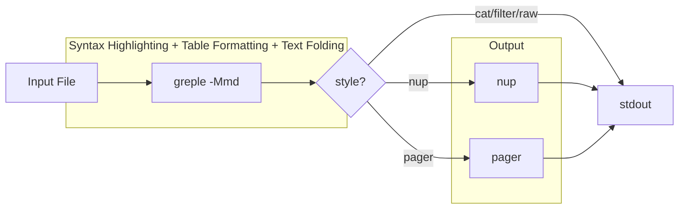

# App-mdee Project Instructions

## Overview

em·dee (mdee: Markdown, Easy on the Eyes) is a Markdown viewer command implemented as a Bash script. It combines greple for syntax highlighting with nup for multi-column paged output.

## Dependencies

| Tool | Package | Role |
|------|---------|------|
| greple | App::Greple | Regex-based syntax highlighting |
| ansifold | App::ansifold | ANSI-aware line folding (via md module) |
| ansicolumn | App::ansicolumn | Table column alignment (via md module) |
| nup | App::nup | Multi-column paged output |
| ansiecho | App::ansiecho | Color output utility |
| getoptlong.sh | Getopt::Long::Bash | Bash option parsing |
| termcolor | Getopt::EX::termcolor | Terminal luminance detection |
| - | Getopt::EX::Config | Module option handling |
| - | Command::Run | Function call wrapper for ansicolumn |

## Project Structure

- `script/mdee` - Main script (Bash) with POD documentation
- `lib/App/mdee.pm` - Perl module (version info only, generated from script/mdee)
- `lib/App/Greple/md.pm` - Greple module for Markdown syntax highlighting (bundled)
- `t/00_compile.t` - Compile tests for both App::mdee and App::Greple::md
- `t/01_mdee.t` - mdee command integration tests
- `t/02_colorize.t` - md module colorize tests (uses t/runner)
- `t/03_nofork.t` - nofork vs fork table formatting tests
- `t/04_table_align.t` - Table alignment tests (parse_separator unit + integration)
- `t/Util.pm` - Test helper for greple-based tests
- `t/runner/` - Submodule (p5-script-runner) for finding greple path
- `t/test.md` - Test Markdown file

**Important:** Documentation (POD) must be written in `script/mdee`. At release time, `minil release` hooks append the POD from `script/mdee` to `lib/App/mdee.pm` (see `minil.toml`).

## Development

### Testing Colors

```bash
./script/mdee t/test.md              # light mode (nup style)
./script/mdee --mode=dark t/test.md  # dark mode
./script/mdee -p t/test.md           # pager style
./script/mdee -f t/test.md           # filter style (stdout)
./script/mdee --list-themes          # show theme samples
```

### Theme System

Built-in themes are defined as Bash associative arrays:
- `theme_light` - Light mode theme (full definition, includes `[base]`)
- `theme_dark` - Dark mode theme (differences from light, includes `[base]`)

Dark theme inherits undefined keys from light immediately after declaration (before config.sh is sourced). This ensures that both arrays have all keys, so config.sh and theme files can safely use `+=` on any key.

#### Theme as Transformation

Themes are not independent definitions — they are **transformations applied to `theme_light`/`theme_dark` and optionally `md_config[]`**. Each theme file is a Bash script that modifies these arrays directly:

```bash
# share/theme/warm.sh — change base color
theme_light[base]='<Coral>=y25'
theme_dark[base]='<Coral>=y80'
```

```bash
# share/theme/hashed.sh — enable closing hashes on h3-h6 via md module config
md_config+=(hashed.h3=1 hashed.h4=1 hashed.h5=1 hashed.h6=1)
```

#### Chaining Themes

The `--theme` option is an array (`@` type) with default value `hashed`, supporting comma-separated values and repeated options. Themes accumulate (added to the default); use `--no-theme` to clear. Duplicate themes are removed by `uniq_array`. Themes are applied in order, each modifying `theme_light`/`theme_dark`:

```bash
mdee file.md                        # default: hashed theme applied
mdee --theme=warm file.md           # hashed (default) + warm
mdee --no-theme file.md             # no theme
mdee --no-theme --theme=warm        # warm only (clear default first)
```

Processing flow:
1. Each theme file is sourced in order (modifies `theme_light`/`theme_dark` and/or `md_config[]`)
2. `load_theme "$mode"` copies the final result to `colors[]`
3. `expand_theme` expands `${base}` references

#### Theme File Locations

Search order for theme files:

1. User theme: `${XDG_CONFIG_HOME:-$HOME/.config}/mdee/theme/NAME.sh`
2. Share theme: `$share_dir/theme/NAME.sh` (installed via distribution or `../share` in development)

The `find_share_dir()` function discovers the installed share directory via `@INC`, with a development fallback to `$0/../share`.

#### User Configuration as Theme

Config.sh and theme files can also modify colors and md module config:

```bash
# config.sh or theme file: change base color
theme_light[base]='<DarkCyan>=y25'
theme_dark[base]='<DarkCyan>=y80'

# config.sh or theme file: enable hashed headings via md module config
md_config+=(hashed.h3=1 hashed.h4=1 hashed.h5=1 hashed.h6=1)
```

#### Theme Listing

- `--list-themes`: Shows preview samples for all available themes. Field names are theme keys excluding `base`.
- Color specs use [Term::ANSIColor::Concise](https://metacpan.org/pod/Term::ANSIColor::Concise): `L00`-`L25` (gray scale), `${base}` (placeholder), `+l10`/`-l10` (lightness adjust), `D`/`I`/`U`/`E` (bold/italic/underline/erase), `FG/BG`.

### User Configuration

Config file: `${XDG_CONFIG_HOME:-~/.config}/mdee/config.sh`

The config file is sourced at global scope (not inside a function), so `declare -A` creates global variables. This allows custom themes to be defined in config.sh.

The `default` associative array supports:

| Key | Option | Example |
|-----|--------|---------|
| `default[mode]` | `--mode` | `dark` |
| `default[theme]` | `--theme` | `custom` |
| `default[style]` | `--style` | `pager` |
| `default[width]` | `--width` | `100` |
| `default[base_color]` | `--base-color` | `DarkCyan` |

Priority: command-line option > config default > built-in default.

Config defaults for `default[theme]` are applied only when `--theme`/`--no-theme` is not specified on the command line. A `theme()` callback sets `_theme_specified` flag to track this.

The `--base-color` option default is empty (no override). Base color is determined by:
1. `--base-color` option (highest priority)
2. `default[base_color]` in config.sh
3. Theme's `[base]` key (e.g., `<RoyalBlue>=y25` for light)

### The `--config` Option

The `--config` option sets config parameters via `Getopt::EX::Config`. It uses `%!` (hash with callback) to preserve spaces in values, accumulating entries in `_config[]`.

Routing logic:
- Keys existing in `theme_light` (`base`, `FILE`, `FILE_FORMAT`) → consumed by bash, applied to both theme arrays
- Everything else → appended to `md_config[]`, forwarded to md module as config params

```bash
for _entry in "${_config[@]}"; do
    _key=${_entry%%=*} _val=${_entry#*=}
    if [[ -v theme_light[$_key] ]]; then
        theme_light[$_key]="$_val"
        theme_dark[$_key]="$_val"
    else
        md_config+=("$_entry")
    fi
done
```

Color labels (h1, bold, etc.) go to md_config and are handled by the md module's `Getopt::EX::Config` (pre-declared with `undef` default). Priority: default colors → config params → `--cm`.

## Implementation Notes

### Pipeline Architecture

mdee constructs a pipeline dynamically:



Each stage is controlled by `--style` and individual `--[no-]fold`, `--[no-]table`, `--[no-]trim`, `--[no-]rule`, `--[no-]nup` options. Fold and table processing are handled within the greple `-Mmd` module (not as separate pipeline stages).

### Style System

The `--style` (`-s`) option controls which pipeline stages are active:

| Style | fold | table | rule | nup | pager | Use case |
|-------|------|-------|------|-----|-------|----------|
| `nup` (default) | on | on | on | on | - | Multi-column paged output |
| `pager` | on | on | on | - | on | Single-column with pager |
| `cat` | on | on | on | - | - | Output to stdout |
| `filter` | - | on | on | - | - | Piping / stdin |
| `raw` | - | - | - | - | - | Highlight only |

Shortcuts: `-f` = `--style=filter`, `-p` = `--style=pager`

```bash
mdee -s pager file.md       # fold + table, output to pager
mdee -f file.md             # table only (filter mode)
mdee -p file.md             # fold + table + pager
mdee -f --fold file.md      # filter + fold override
```

#### Implementation

Style defaults are applied after option parsing using a sentinel value:

```bash
[        style | s  :       # output style      ]=nup
[       filter | f   !      # filter mode       ]=
[        plain | p   !      # plain mode        ]=
[         fold |            # line folding      ]=_
[        table |            # table formatting  ]=_
[         trim |            # trim table cell spaces]=1
[          nup |            # use nup           ]=_
[         rule |            # table rule lines  ]=_
```

- `fold`/`table`/`nup`/`rule` default to sentinel `_` (not user-set)
- `trim` defaults to `1` (always on unless explicitly `--no-trim`), not style-dependent
- After getoptlong.sh, style defaults are applied only to sentinel values
- Explicit `--fold`/`--no-fold` sets the value to `1`/empty, overriding style
- `filter()` and `plain()` callbacks set `$style` during option parsing
- The `!` marker triggers the callback when option is parsed

```bash
filter() { style=filter; }
plain()  { [[ $plain ]] && style=pager || style=nup; }

# After getoptlong.sh:
case $style in
    nup)    style_defaults=([fold]=1 [table]=1 [nup]=1 [rule]=1) ;;
    pager)  style_defaults=([fold]=1 [table]=1 [nup]=  [rule]=1) ;;
    ...
esac
[[ $fold  == _ ]] && fold=${style_defaults[fold]}
[[ $table == _ ]] && table=${style_defaults[table]}
[[ $nup   == _ ]] && nup=${style_defaults[nup]}
[[ $rule  == _ ]] && rule=${style_defaults[rule]}
[[ ${rule:-} ]] && rule='│'
```

#### Pager Stage

When `style=pager`, the `run_pager` function is appended to the pipeline:

```bash
run_pager() { invoke ${PAGER:-less}; }

# Set defaults for less environment
export LESS="${LESS:--R}"
export LESSANSIENDCHARS="${LESSANSIENDCHARS:-mK}"

# Added to stages when style=pager:
[[ $style == pager ]] && stages+=(run_pager)
```

- `LESS=-R`: Required for ANSI color sequences (set when `LESS` is not defined)
- `LESSANSIENDCHARS=mK`: Recognize SGR (`m`) and erase line (`K`) sequences (set when not defined)
- These affect both direct pager mode and `nup` (which invokes `less` internally)
- User's existing environment settings are not overridden

#### Command Invocation Wrapper

All `run_XXX` functions use `invoke` to execute commands. When `debug > 1` (`-dd`), it prints the full command with quoted arguments to stderr. In dryrun mode, `invoke` skips execution:

```bash
invoke() {
    (( debug > 1 )) && echo "debug: $(printf '%q ' "$@")" >&2
    [[ ${dryrun:-} ]] && return
    "$@"
}
```

Debug levels:
- `-d` (`debug > 0`): `theme_light[]`/`theme_dark[]` values (sourceable format), pipeline stage names
- `-dd` (`debug > 1`): above + full command lines for each pipeline stage

Dryrun combinations:
- `-dn`: show pipeline as function names (e.g., `run_greple "$@" | run_nup`)
- `-ddn`: show expanded command lines for each stage without executing

### App::Greple::md Module

Syntax highlighting, table formatting, and text folding are handled by the `App::Greple::md` Perl module. mdee invokes `greple -Mmd::config(mode,foldlist,foldwidth,table,table_trim,rule,heading_markup,...) -- --filter --filestyle=once --color=always`.

- `-Mmd::config(...)`: Module config params (mode, foldlist, foldwidth, table, table_trim, rule, heading_markup, hashed.*, color labels)
- `--show LABEL=VALUE`: Field visibility control; passed from `show[]` array
- `pass_md[]`: Passthrough options for md module (e.g., `--colormap` via `:>pass_md`)
- Options before `--` are module-specific; after `--` are greple options
- Fold controlled via `foldlist=1`; md module adds `--fold-by $foldwidth` to its default option

### Protection Mechanism (protect/restore)

Early-processed regions (code blocks, inline code, comments, links) are replaced with ANSI-based placeholders `\e[256mN\e[m` to protect them from later patterns.

- Placeholder uses SGR 256 (impossible color, terminals ignore) + index into `@protected` array
- The `\e[m` reset at end enables **cumulative coloring**: when `apply_color` wraps placeholder with outer color (e.g., heading), it re-inserts the outer color after the reset
- Each step is a `Step` object: `Step(sub{})` (always active) or `Step(label => sub{})` (controllable via `--show`)
- Pipeline order determined by `build_pipeline()` based on `heading_markup`

#### Pipeline Architecture

Steps are organized into three groups:

```perl
my @protect_steps = qw(code_blocks comments image_links images links);
my @inline_steps  = qw(inline_code horizontal_rules bold_italic bold italic strike);
my @final_steps   = qw(blockquotes);
```

The `headings` step always calls `restore()` → color → `protect()`,
enabling cumulative coloring regardless of position. Its position
in the pipeline is controlled by `heading_markup`:

**`build_pipeline()` logic:**
- `heading_markup=0` (default): `@protect_steps`, **headings**, `@inline_steps`, `@final_steps`
- `heading_markup=1` or `all`: `@protect_steps`, `@inline_steps`, **headings**, `@final_steps`
- `heading_markup=bold:italic`: `@protect_steps`, bold, italic, **headings**, inline_code, horizontal_rules, strike, `@final_steps`

When `heading_markup` is a colon-separated step list, specified steps
are moved before headings while remaining inline steps stay after.
This allows selective markup inside headings (e.g., bold but not code).

Links are always processed before headings (in `@protect_steps`), so
OSC 8 hyperlinks in headings remain clickable regardless of
`heading_markup`.

The `colorize()` loop calls `$step->active` and `$step->run`:

```perl
for my $name (build_pipeline()) {
    my $step = $colorize{$name};
    $step->run if $step->active;
}
```

### Code & Emphasis Color Labels

Code-related and emphasis-related theme keys map directly to module labels:

| Theme Key | Module Label | Description |
|-----------|-------------|-------------|
| `code_mark` | `code_mark` | Fenced code block delimiters (```` ``` ````, `~~~`) |
| `code_tick` | `code_tick` | Inline code backticks (`` ` ``) |
| `code_info` | `code_info` | Fenced code block info string |
| `code_block` | `code_block` | Fenced code block body (with `;E`) |
| `code_inline` | `code_inline` | Inline code body (without `;E`) |
| `emphasis_mark` | `emphasis_mark` | Emphasis markers (`**`, `*`, `__`, `_`, `~~`) |

`emphasis_mark` is the default color for all emphasis markers. Per-type overrides
(`bold_mark`, `italic_mark`, `strike_mark`) can be defined via `--cm` and take
priority when present. This follows the same pattern as `code_tick` / `code_inline`.

```bash
# Light mode
[code_mark]='L20'
[code_tick]='L15/L23'
[code_info]='${base_name}=y70'
[code_block]='/L23;E'
[code_inline]='L00/L23'
[emphasis_mark]='L18'

# Dark mode
[code_mark]='L10'
[code_tick]='L15/L05'
[code_info]='L10'
[code_block]='/L05;E'
[code_inline]='L25/L05'
[emphasis_mark]='L10'
```

The `code_block` label includes `;E` (erase line) for full-width background on fenced code blocks. `code_tick` has background color matching `code_inline` for visual continuity, with dimmer foreground. `code_inline` has explicit foreground (`L00`/`L25`) to prevent heading foreground from bleeding through in cumulative coloring.

Inline code backticks are displayed as `` `content´ `` using `code_tick` color for the markers. Multi-backtick delimiters (``` `` ```, ```` ``` ````, etc.) are collapsed to a single pair, with optional surrounding spaces stripped per CommonMark. The open/close markers are configurable via `tick_open`/`tick_close` config parameters (default: `` ` `` / `´`).

Regex patterns used by the md module:

Fenced code blocks ([CommonMark](https://spec.commonmark.org/0.31.2/#fenced-code-blocks)):
```
^ {0,3}(?<bt>`{3,}+|~{3,}+)(.*)\n((?s:.*?))^ {0,3}(\g{bt})
```

Inline code ([CommonMark Code Spans](https://spec.commonmark.org/0.31.2/#code-spans)) uses the `$CODE` pattern, which matches both single and multi-backtick spans. For multi-backtick (2+), optional leading/trailing spaces are stripped per CommonMark spec.

### Text Folding (md module)

Text folding is handled within the `App::Greple::md` module using `-Mtee` to pipe matched regions through `ansifold`. The md module defines `--fold-by` as a greple option in its `__DATA__` section, and `--fold` is dynamically defined in `finalize()` via `$mod->setopt()` as a command option alias. The module option `--foldlist` enables folding via config.

#### Fold Architecture

- `foldlist` config parameter (default: 0) enables/disables folding
- `foldwidth` config parameter (default: 80) controls the fold width
- `finalize()` defines `--fold` as `--fold-by $foldwidth` via `$mod->setopt()` (for direct command-line use)
- When `foldlist=1` in config, `finalize()` adds `--fold-by $foldwidth` to the module's default option
- mdee passes `foldlist=1,foldwidth=$width` in config when fold is enabled
- The `--fold-by` option in `__DATA__` uses `-Mtee "&ansifold"` with `--exclude` patterns for code blocks, HTML comments, and tables

#### Definition List Pattern

`(?:\A|\G\n|\n\n).+\n\n?(:\h+.*\n)`

- `(?:\A|\G\n|\n\n)`: Start of file, or after previous match, or after blank line
- `.+\n`: Term line
- `\n?`: Optional blank line between term and definition
- `(:\h+.*\n)`: Capture group for definition line (only this part is processed)

#### Table Formatting in md Module

Table formatting is handled within the `App::Greple::md` module's `begin()` function, which orchestrates `colorize()` (syntax highlighting) followed by `format_table()`:

```perl
sub begin {
    colorize()    if $config->{colorize};
    format_table() if $config->{table};
}
```

Stage execution is controlled by config flags: `colorize` (default: 1), `table` (default: 1). Fold is not controlled in `begin()` because it operates via greple's pattern matching pipeline (`-Mtee`), not text transformation in the `begin` hook.

`format_table()` detects table blocks via `(^ {0,3}\|.+\|\n){3,}` and processes each block:

```perl
s{(^ {0,3}\|.+\|\n){3,}}{
    my $block = $&;
    my($right, $center) = parse_separator(\$block);
    my @sep_opt;
    if ($config->{table_trim}) {
        @sep_opt = ('-rs', '\s*\|\s*', '--item-format= %s ', '--table-remove=1,-0', '--padding');
    } else {
        $_++ for @$right, @$center;
        @sep_opt = ('-s', '|');
    }
    my @align = (
        @$right  ? ('--table-right='  . join(',', @$right))  : (),
        @$center ? ('--table-center=' . join(',', @$center)) : (),
    );
    my $formatted = call_ansicolumn($block, @sep_opt, '-o', $sep, '-t', '--cu=1', @align);
    fix_separator($formatted, $sep);
}mge;
```

**Trim mode** (`table_trim=1`, default): Strips cell whitespace with `-rs '\s*\|\s*'`, adds padding with `--item-format=' %s '`, removes the leading/trailing empty columns created by `|` delimiters with `--table-remove=1,-0`, and uses `--padding` to pad the last column to full width.

**Non-trim mode** (`table_trim=0`): Uses `-s '|'` as simple separator. Column numbers from `parse_separator` need `+1` offset because the leading `|` creates an empty column 1 in ansicolumn's split.

1. **Alignment parsing** — `parse_separator()` analyzes the separator line and returns raw column number arrays:

```perl
sub parse_separator {
    my $blockref = shift;
    my $SEP = qr/^\h*\|(?:\h*:?-+:?\h*\|)+\h*$/m;
    my ($sep_line) = $$blockref =~ /($SEP)/;
    return ([], []) unless defined $sep_line;
    my @cells = split /\|/, $sep_line, -1;
    shift @cells; pop @cells;
    s/^\h+|\h+$//g for @cells;
    my @right  = grep { $cells[$_-1] =~ /^-+:$/  } 1..@cells;
    my @center = grep { $cells[$_-1] =~ /^:-+:$/ } 1..@cells;
    $$blockref =~ s{$SEP}{ ${^MATCH} =~ tr/:/-/r }mpe;
    (\@right, \@center);
}
```

   - Finds separator line via `$SEP` pattern (each cell requires at least one `-`)
   - Splits cells with `split /\|/, $sep_line, -1` (the `-1` limit preserves trailing empty fields from the final `|`)
   - Detects `:---:` (center) and `---:` (right) patterns; `:---` and `---` are left-aligned (default, no option needed)
   - Returns raw 1-based column numbers as `(\@right, \@center)` — caller applies offset and builds option strings
   - Strips colons from separator line (`tr/:/-/`) so `fix_separator()` works unchanged
   - Requires App::ansicolumn >= 1.55 (for `--table-right`, `--table-center`, `--table-remove`, `--item-format`, `--padding`)

2. **Column alignment** — `call_ansicolumn()` invokes `App::ansicolumn::ansicolumn()` via `Command::Run` (same pattern as the tee module's `call()` function):
   - `-rs '\s*\|\s*'` (trim) or `-s '|'` (non-trim): Input separator
   - `--item-format=' %s '` (trim only): Add padding to each cell
   - `--table-remove=1,-0` (trim only): Remove leading/trailing empty columns
   - `--padding` (trim only): Pad last column to full width
   - `-o $sep`: Output separator (`│` when rule is enabled, `|` otherwise)
   - `-t`: Table mode (auto-determine column widths)
   - `--cu=1`: Column unit (minimum column width)
   - `--table-right=N`: Right-align specified columns
   - `--table-center=N`: Center-align specified columns

3. **Separator fix** — `fix_separator()` converts separator lines to box-drawing characters, handling optional leading/trailing border separators:

```perl
sub fix_separator {
    my ($text, $sep) = @_;
    my $sep_re = $sep eq "\x{2502}" ? "\x{2502}" : '\\|';
    $text =~ s{^(\h*?)($sep_re)?((?:\h*-+\h*$sep_re)*\h*-+\h*)($sep_re)?(\h*?)$}{
        my($pre, $left, $mid, $right, $post) = ($1, $2, $3, $4, $5);
        if ($sep eq "\x{2502}") {
            ($pre  =~ tr[ ][\x{2500}]r)
            . (defined $left  ? "\x{251C}" : '')
            . ($mid =~ tr[\x{2502} -][\x{253C}\x{2500}\x{2500}]r)
            . (defined $right ? "\x{2524}" : '')
            . ($post =~ tr[ ][\x{2500}]r)
        } else { ... }
    }xmeg;
    $text;
}
```

   - Leading/trailing `$sep_re` are optional (`?`) — trim mode removes border columns, so separators may not have leading/trailing `│`
   - `$pre`/`$post` capture surrounding whitespace (from `--padding`), converted to `─` in rule mode
   - Rule mode: `│` → `┼`, spaces/dashes → `─`, borders `├`/`┤` only when present
   - Non-rule mode: spaces → `-`, borders `|` only when present

Config parameters from mdee:
- `foldlist=1`: Enable text folding (default disabled in md module)
- `foldwidth=$width`: Fold width in columns
- `table=1`: Enable table formatting (default enabled in md module)
- `table_trim=1`: Enable cell whitespace trimming (default enabled in md module)
- `rule=1`: Enable box-drawing characters (default enabled in md module)
- Color labels (e.g., `h1=RD`): Override default colors (pre-declared in `Config->new()` with `undef`, applied in `setup_colors()` before `${base}` expansion)

### Field Visibility with --show Option

The `--show` option controls field visibility using a hash type with callback:

```bash
declare -A show=()

declare -A OPTS=(
    [         show |   %!          # field visibility   ]=
)

show() {
    local arg=$2 key val
    if [[ $arg == *=* ]]; then
        key=${arg%%=*} val=${arg#*=}
    else
        key=$arg val=1
    fi
    if [[ $key == all ]]; then
        for k in "${show_fields[@]}"; do
            show[$k]=$val
        done
    fi
}
```

- `%!`: Hash type with callback
- Callback receives `($optname, $arg)` - parse key=value from `$arg`
- `all` is special: sets all fields to the given value
- Order matters: `--show all= --show bold` disables all, then enables bold
- Individual key=value is automatically handled by getoptlong.sh

In `run_greple()`, show values are passed to the md module:

```bash
for name in "${!show[@]}"; do
    [[ $name == all ]] && continue
    md_opts+=(--show "${name}=${show[$name]}")
done
```

The md module's `active()` function checks show flags and skips regex substitutions entirely for disabled fields.

### Emphasis Patterns (CommonMark)

Bold/italic/strike patterns use `$SKIP_CODE` as first alternative to skip code spans. Named captures `(?<m>...)` (markers) and `(?<t>...)` (content) with `\g{m}` backreference prevent mixing (`**...__`).

- `(?<![\\\w])` / `(?!\w)`: Word boundaries for `_`/`__` (prevents `foo_bar_baz`)
- `(?<!\*)` / `(?!\*)`: Distinguishes `*italic*` from `**bold**`
- `mark_color($type, $text)`: Uses `${type}_mark` if in colormap, falls back to `emphasis_mark`
- `/p` flag with `${^MATCH}`: Safe alternative to `$&` (used by `$SKIP_CODE`)

### OSC 8 Hyperlinks

Links are converted to OSC 8 terminal hyperlinks. Three types (in processing order): `image_link` (`[](url)`), `image` (``), `link` (`[text](url)`). Each is colored, wrapped in OSC 8, and protected. Disable with `config(osc8=0)`.

URL encoding: `uri_escape_utf8($url, "^\\x20-\\x7e")` — escapes only non-ASCII, preserving `:`, `/`, etc.

#### Code Span Pattern and `(*SKIP)(*FAIL)` Protection

`$CODE` matches code spans (named captures `_bt`, `_content`). `$SKIP_CODE = qr{$CODE (*SKIP)(*FAIL)}` is used as first alternative in link/emphasis substitutions to skip code spans. Named captures required — `$SKIP_CODE` consumes `$1`. Link pattern retains `(?<![!\e])` for image prefix and protect placeholder.

#### Link Text Matching Pattern

`$LT = qr/(?:`[^`\n]*+`|\\.|[^`\\\n\]]++)+/` — three branches: backtick-span (allows `]` inside), backslash-escape (`\]`), any other char. Possessive quantifiers prevent backtracking.

### Mode Detection with [Getopt::EX::termcolor](https://metacpan.org/pod/Getopt::EX::termcolor)

Terminal background luminance (0-100) is detected via OSC 11 query. Luminance < 50 → dark mode, ≥ 50 → light mode.

### [Getopt::Long::Bash](https://metacpan.org/pod/Getopt::Long::Bash) (getoptlong.sh)

Option parsing uses getoptlong.sh from Getopt::Long::Bash module.

#### OPTS Array Format

```bash
declare -A OPTS=(
    [&REQUIRE]=0.7.1 [&USAGE]="$USAGE"
    [  option | o  :  # comment  ]=default
)
```

Key format: `option_name | short_opt  spec  # comment`

- `option_name`: Long option name (becomes variable `$option_name`)
- `short_opt`: Single character short option
- `spec`: Option specification
- `# comment`: Description for help

#### Option Specifications

|Spec|Type|Description|
|-|-|-|
|(empty)|Boolean|Flag, sets variable to 1. `--no-` prefix supported.|
|`!`|Callback|Calls function with same name as option|
|`+`|Incremental|Counter, increases with each use|
|`:`|Required arg|Requires argument value|
|`:=i`|Integer|Requires integer argument|
|`?!`|Optional+Callback|Optional argument with callback|
|`%`|Hash|Hash variable, `--opt key=value`|
|`%!`|Hash+Callback|Hash variable with callback|
|`:>array`|Array append|Appends `--option=value` to named array|
|`@`|Array|Array variable, supports comma-separated values|

#### Special Keys

- `[&REQUIRE]=version`: Minimum getoptlong.sh version
- `[&USAGE]="..."`: Usage message for --help
- If a function with the same name as an option exists, it's called after parsing (callback)
- Invocation: `. getoptlong.sh OPTS "$@"`

## Limitations

### HTML Comments

Only HTML comments starting at the beginning of a line are highlighted. Inline comments are not matched to avoid conflicts with inline code containing comment-like text (e.g., `` `<!-->` ``).

### Emphasis (Bold/Italic)

Emphasis patterns do not span multiple lines. Multi-line bold or italic text is not supported.

`***bold italic***` and `___bold italic___` are supported as a combined pattern (processed before bold and italic, result is `protect()`ed). Other nested forms (e.g., `**bold _italic_**`) are not supported.

### Links

Link patterns do not span multiple lines. The link text and URL must be on the same line.

Link text matching uses `` (?:`[^`\n]*+`|\\.|[^`\\\n\]]++)+  `` to handle:
- `]` inside backtick-quoted text (e.g., `` [`init [CONFIGS...]`](#url) ``) — deviates from CommonMark spec (which terminates `]` even inside code spans) but matches GitHub rendering
- Backslash-escaped `\]` (e.g., `[foo\]bar](#url)`) — per CommonMark spec, `\]` does not terminate link text

By default, inline code and emphasis inside headings are not processed
(headings get uniform color). Links are always processed as OSC 8
hyperlinks. With `--heading-markup` (`--hm`), all inline formatting
is visible within headings via cumulative coloring. Specific steps
can be selected: `--hm=bold:italic` processes only bold and italic
inside headings.

Reference-style links (`[text][ref]` with `[ref]: url` elsewhere) are not supported.

### Indented Line Folding (TODO)

Lines starting with whitespace are not currently folded. Adding `^\h+.*\n` to the fold target would enable autoindent-aware wrapping, but the following issues must be resolved first:

1. **Pandoc non-pipe tables**: Simple tables, grid tables, and multiline tables use lines starting with spaces/dashes. These would be incorrectly folded. Pandoc table detection and exclusion is needed before enabling indented line folding.

2. **List continuation lines**: Indented continuation lines (without list markers) may be intentionally formatted across multiple lines. Folding them would merge separate items.

The `autoindent` pattern in the md module's `--fold-by` option already includes `|^\h+` in preparation. The `--exclude` mechanism in the option definition handles code blocks, comments, and tables.

### OSC 8 Hyperlinks

OSC 8 hyperlinks require terminal support. Compatible terminals include iTerm2, Kitty, WezTerm, Ghostty, and recent versions of GNOME Terminal. Apple's default Terminal.app does not support OSC 8.

When using `less` as pager, version 566 or later is required with `-R` option.

## Build & Release

This project uses Minilla. See global CLAUDE.md for release instructions.

```bash
minil build    # Build and update generated files
minil test     # Run tests
minil release  # Release (interactive)
```

